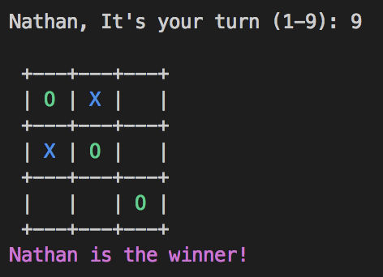

# tic-tac-toe

> Simple game of tic-tac-toe that you can play in the command line. I spent a couple of hours creating this for fun and so I can practice python.



### Usage: 

Make sure you are using python 3

```
python3 game.py
```

